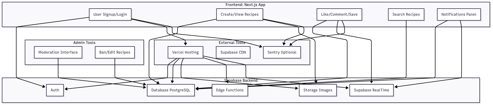
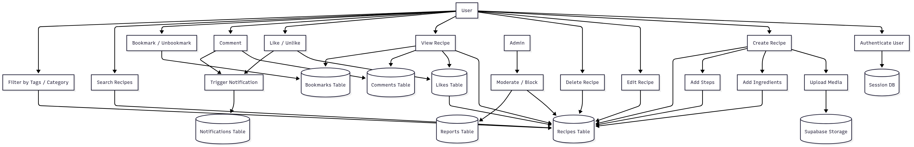
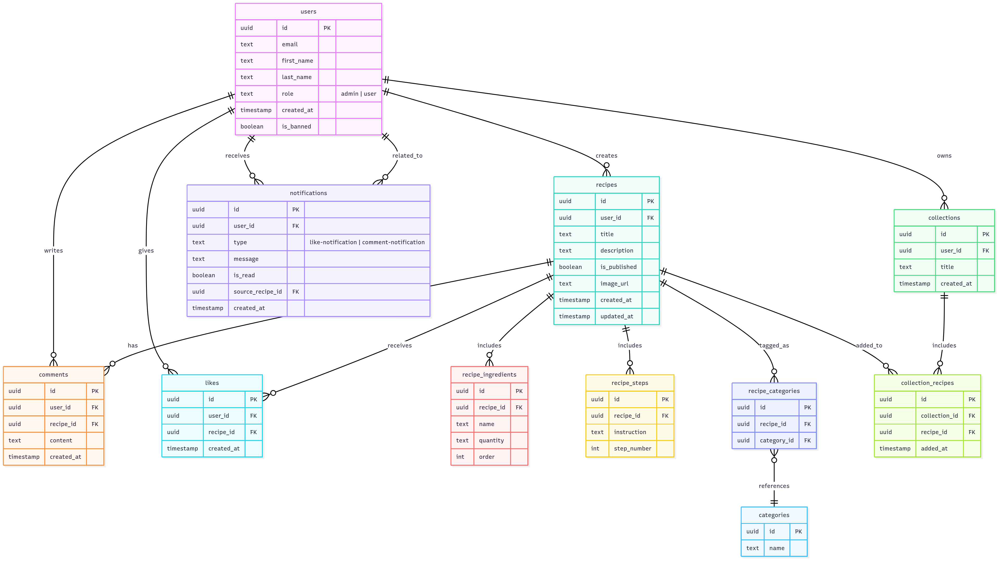

# RecipeStudio Architecture Design

## Tech Stack

### Frontend
- **Next.js (App Router)**: Server-side rendering and static site generation for SEO-friendly pages. App Router enables efficient routing and data fetching with React Server Components.
- **ShadCN**: Component library for building a consistent, accessible, and customizable UI with Tailwind CSS for styling.
- **React Query**: For data fetching, caching, and state management to optimize API calls and improve UX.
- **Zustand**: Lightweight state management for handling user authentication and UI state.

## ⚙️ Scalability Plan

- Supabase handles horizontal scaling:
  - Managed PostgreSQL
  - File storage
  - Edge Functions

- Add PostgreSQL indexes on:
  - `recipes.created_at`
  - `likes.count`
  - `categories`
  - Any other high-traffic fields

- Optional queue system (for future scaling):
  - Use Supabase Edge Functions + a background job queue (e.g., for email processing, AI moderation)

- Load-balanced Supabase Functions:
  - Deploy via **Vercel** or **Deno Deploy**, based on future growth and requirements

- Image optimization via CDN:
  - Use services like **imgix**, **Cloudinary**, or **Cloudflare** for responsive delivery on all screen sizes

---

## 🚀 Performance Optimizations

- Use **Next.js Incremental Static Regeneration (ISR)** for the main recipe feed
  - Enables revalidation without full rebuilds

- Apply **infinite scrolling** with proper **pagination** to reduce initial load time

- Index commonly filtered fields:
  - `recipes.category_id`
  - `recipes.ingredients` (use GIN index)
  - `recipes.created_at`

- Use **PostgreSQL full-text search**:
  - Add weights to columns such as `title`, `ingredients`, and `description`


### Backend
- **Supabase (Backend-as-a-Service)**:
  - **Auth**: Handles user registration, login, and role-based access control (RBAC).
  - **Database**: PostgreSQL for structured data storage (users, recipes, comments, etc.).
  - **Storage**: For uploading and serving recipe images.
  - **Realtime**: For live notifications on likes and comments.
- **Next.js API Routes**: For custom backend logic, such as complex queries or third-party integrations, deployed as serverless functions.

### Third-Party Services
- **Cloudflare CDN**: For caching static assets (images, CSS, JS) to reduce latency.
- **Vercel**: For hosting and deploying the Next.js application with automatic scaling.
- **Resend**: For transactional emails (e.g., password resets, welcome emails).

## Architecture Design


## Data Flow Diagram


## Database Design
The ERD below represents the database schema for RecipeStudio, designed in PostgreSQL with Supabase.



<xaiArtifact artifact_id="99d81231-d134-45cd-b763-bc95f8ea15a6" artifact_version_id="f4b711f5-6890-47ae-b590-7ad49c0b0762" title="recipestudio_erd.mmd" contentType="text/mermaid">


```mermaid
erDiagram
  users ||--o{ recipes : creates
  users ||--o{ comments : writes
  users ||--o{ likes : gives
  users ||--o{ collections : owns
  users ||--o{ notifications : receives

  recipes ||--o{ comments : has
  recipes ||--o{ likes : receives
  recipes ||--o{ recipe_ingredients : includes
  recipes ||--o{ recipe_steps : includes
  recipes ||--o{ recipe_categories : tagged_as
  recipes ||--o{ collection_recipes : added_to

  collections ||--o{ collection_recipes : includes

  recipe_categories }o--|| categories : references

  notifications }o--|| users : related_to

  users {
    uuid id PK
    text email
    text first_name
    text last_name
    text role "admin | user"
    timestamp created_at
    boolean is_banned
  }

  recipes {
    uuid id PK
    uuid user_id FK
    text title
    text description
    boolean is_published
    text image_url
    timestamp created_at
    timestamp updated_at
  }

  recipe_ingredients {
    uuid id PK
    uuid recipe_id FK
    text name
    text quantity
    int order
  }

  recipe_steps {
    uuid id PK
    uuid recipe_id FK
    text instruction
    int step_number
  }

  comments {
    uuid id PK
    uuid user_id FK
    uuid recipe_id FK
    text content
    timestamp created_at
  }

  likes {
    uuid id PK
    uuid user_id FK
    uuid recipe_id FK
    timestamp created_at
  }

  collections {
    uuid id PK
    uuid user_id FK
    text title
    timestamp created_at
  }

  collection_recipes {
    uuid id PK
    uuid collection_id FK
    uuid recipe_id FK
    timestamp added_at
  }

  categories {
    uuid id PK
    text name
  }

  recipe_categories {
    uuid id PK
    uuid recipe_id FK
    uuid category_id FK
  }

  notifications {
    uuid id PK
    uuid user_id FK
    text type "like-notification | comment-notification"
    text message
    boolean is_read
    uuid source_recipe_id FK
    timestamp created_at
  }


